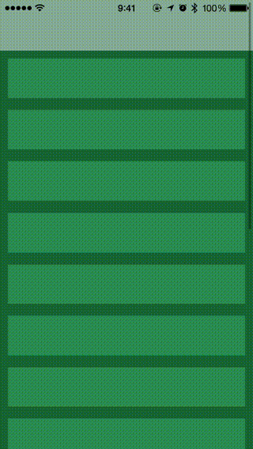

# ARNSpaceStretchFlowLayout

It was inspired by the following products.(Respect!)

- [Evernote](https://evernote.com/) (iOS)

- [EvernoteEffect](https://github.com/kimsungwhee/EvernoteEffect) (objc)

- [Stretchy-Collection-View](https://github.com/cnoon/Stretchy-Collection-View) (objc)

## Usage

To run the example project, clone the repo, and run `pod install` from the Example directory first.

## Requirements

- iOS 8.0+ & ARC

- CcoaPods 0.36.0+ (if use CcoaPods)

## Installation

### CocoaPods

ARNSpaceStretchFlowLayout is available through [CocoaPods](http://cocoapods.org). To install
it, simply add the following line to your Podfile:

    pod "ARNSpaceStretchFlowLayout"

### Carthage

please wait..

## License

ARNSpaceStretchFlowLayout is available under the MIT license. See the LICENSE file for more info.
